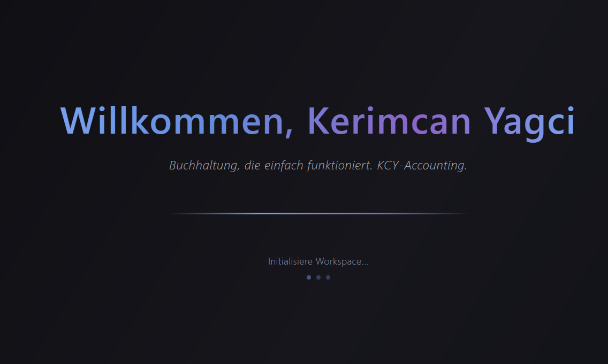
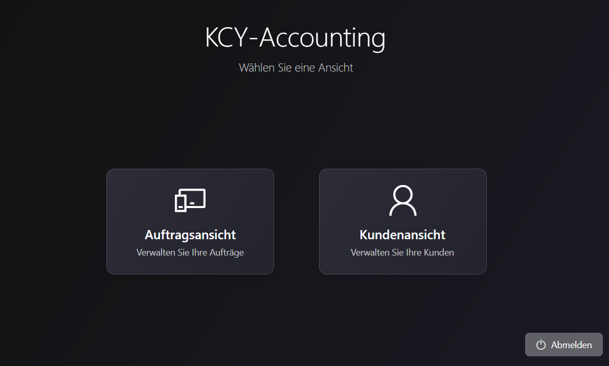
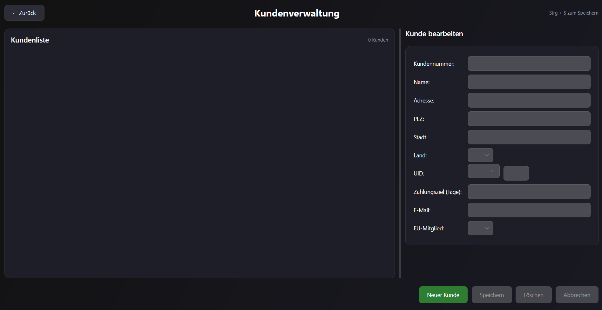

# KCY-Accounting

**KCY-Accounting** is a cross-platform desktop application for order and customer management with integrated TCP-based license validation. Built with .NET 8 and Avalonia UI, it offers a modern interface and robust features tailored for small to medium businesses.

## 🚀 Features

- Cross-platform support: Windows, macOS, and Linux  
- Comprehensive order and customer management  
- TCP-based license validation system  
- Modern, user-friendly UI powered by Avalonia

## 🖼️ Screenshots

### Welcome Screen  


### Main View  


### Customer Management  


*Please add the screenshots to the `docs/` folder and name them accordingly.*

## 🛠️ Technologies

- C# and .NET 8  
- Avalonia UI  
- SQLite (optional)  
- TCP for license validation

## 📦 Installation

```bash
git clone https://github.com/KerYagciHTL/KCY-Accounting.git
cd KCY-Accounting\LicenseServer
.\build.bat
cd publish
start LicenseServer.exe
cd ..\..
cd KCY-Accounting
dotnet build
dotnet run

